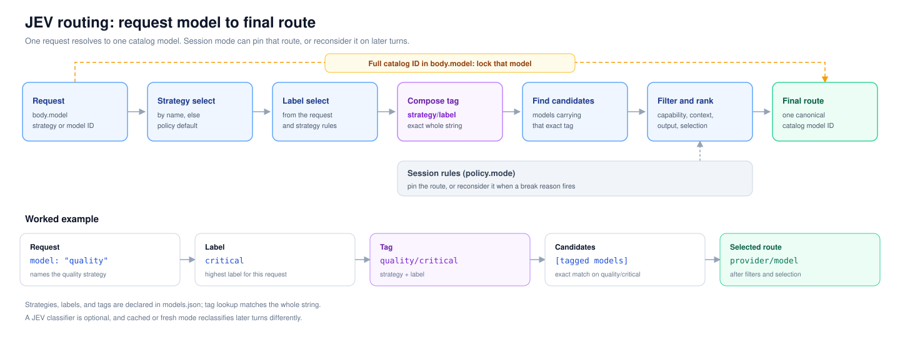

# JEV Gateway

**English** | [简体中文](README.zh-CN.md)

 

JEV Gateway routes OpenAI-compatible chat requests across model providers using configurable
cost, quality, and capability rules. Choose a strategy instead of hard-coding a model, and either
keep a session on one route or reconsider it each turn.

[Quick start](#quick-start) · [Model identity](#model-identity) · [Routing strategies](#routing-strategies) · [HTTP API](#http-api) · [Documentation](#documentation) · [License](#license) · [Development](#development)

## What it does

- Serves `POST /v1/chat/completions` for clients configured with the gateway URL and a catalog model or strategy name.
- Can classify work by task type, scale, and rigor, then select from configured model pools.
- Optionally asks a System One classifier typed choice questions, with local scoring or a configured fallback when unavailable.
- Supports session pinning and per-turn selection; the shipped `task_aware` strategy uses `fresh` mode.
- Derives a `reasoning_effort` level per route and clamps it to the levels that route accepts.
- Records requests, decisions, outcomes, and provider continuation state in SQLite; recording failures do not fail chat requests.
- Ships a dashboard for live sessions and a small API for routing inspection.



## Quick start

Needs Python 3.10+, [`uv`](https://docs.astral.sh/uv/), and access to your configured upstream models.

```bash
git clone https://github.com/TexasOct/jev-gateway.git
cd jev-gateway
uv sync --all-groups
```

Initialize the runtime directory. This copies the public templates once and never overwrites
existing files:

```bash
./scripts/install-local.sh --editable
```

Edit the two files under `$HOME/.jev-gateway/`:

```bash
${EDITOR:-vi} "$HOME/.jev-gateway/models.json"  # providers, models, strategies
${EDITOR:-vi} "$HOME/.jev-gateway/.env"         # secrets named by models.json
```

Replace the example endpoints and model names with ones your providers support. The template declares two providers, so its `.env` needs:

```dotenv
DEEPSEEK_API_KEY=replace-with-deepseek-key
OPENAI_API_KEY=replace-with-openai-key
```

Start the gateway:

```bash
~/.local/bin/jev-gateway-local
```

In another terminal, send a first request:

```bash
curl http://127.0.0.1:8000/v1/chat/completions \
  -H 'Content-Type: application/json' \
  -d '{"model": "task_aware", "messages": [{"role": "user", "content": "Summarize this design."}]}'
```

The template disables System One, so `task_aware` uses its configured fallback until you enable it.
`GET /healthz` confirms the process is up. For persistent, container, and wheel installs, see
[`docs/local-install.md`](docs/local-install.md).

## Model identity

A catalog model is indexed by its provider-qualified ID, `<provider>/<upstream_model>`. The
`providers` block holds transport settings once; each model points at a provider and adds
capabilities, limits, cost, and routing tags:

```json
{
  "providers": [
    {"id": "deepseek", "type": "deepseek", "api_base": "https://api.deepseek.com/v1", "api_key_env": "DEEPSEEK_API_KEY"}
  ],
  "models": [
    {"provider": "deepseek", "upstream_model": "deepseek-flash", "tags": ["task_aware/draft"], "context_window": 1000000}
  ]
}
```

This model's ID is `deepseek/deepseek-flash`. Bare upstream names are not valid manual selections
because they are not globally unique. Full field reference: [`docs/models-config.md`](docs/models-config.md).

## Routing strategies

Every named strategy is also a virtual model name. Send the strategy name in the request body's
`model` field; the default is `task_aware`.

```json
{"model": "quality", "messages": [{"role": "user", "content": "Review this design."}]}
```

Each strategy inherits its settings from the top-level `policy` block and can override `selection`,
`mode`, `labels`, and reasoning rules. Built-in modes are `sticky`, `cached`, `escalate`,
`adaptive`, and `fresh`. Explicit built-in strategy kinds are `policy`, `jev`, and `jev_matrix`. A concrete
catalog model ID such as `openai/gpt-5.6-sol` selects that model directly. Omitted `kind` uses `auto` dispatch; see the design reference.

Only the request-body `model` field selects a strategy. `?strategy=` returns `400`, and the
`X-JEV-Strategy` request header is ignored for selection. Design and configuration details:
[`docs/routing-design.md`](docs/routing-design.md).

## HTTP API

| Method | Path | Purpose |
| --- | --- | --- |
| `GET` | `/healthz` | Liveness and configuration snapshot. |
| `GET` | `/dashboard` | Live session dashboard. |
| `GET` | `/v1/models` | Strategy names and catalog model IDs. |
| `GET` | `/v1/routing/policy` | Active policy snapshot. |
| `GET` | `/v1/routing/strategies` | Registered strategies and policies. |
| `POST` | `/v1/routing/preview` | Route a request without serving it. |
| `POST` | `/v1/routing/reload` | Re-read the catalog file. |
| `GET` | `/v1/routing/decisions/{decision_id}` | One retained decision. |
| `GET` | `/v1/routing/sessions` | Live sessions. |
| `GET` | `/v1/routing/sessions/{session_id}` | One live session. |
| `GET` | `/v1/routing/sessions/{session_id}/requests` | Retained requests for a session. |
| `GET` | `/v1/routing/providers/summary` | Retained provider activity. |
| `POST` | `/v1/chat/completions` | OpenAI-compatible chat completion. |

Successful chat responses carry `X-JEV-Route`, `X-JEV-Provider`, `X-JEV-Model`, `X-JEV-Route-Label`,
`X-JEV-Task-Type`, `X-JEV-Mode`, `X-JEV-Reason`, `X-JEV-Strategy`, `X-JEV-Decision-Id`, and, when
relevant, request, session, switch, reasoning, and switch-blocking headers. Endpoint contracts,
authentication, error codes, and reload semantics: [`docs/http-api.md`](docs/http-api.md).

## Documentation

| Document | Contents |
| --- | --- |
| [`docs/local-install.md`](docs/local-install.md) | Local, container, and wheel installation. |
| [`docs/models-config.md`](docs/models-config.md) | Every `models.json` field. |
| [`docs/routing-design.md`](docs/routing-design.md) | Routing contracts, strategies, sessions, evidence. |
| [`docs/http-api.md`](docs/http-api.md) | Endpoints, headers, errors, reload. |

## License

Licensed under the [GNU Affero General Public License v3.0 or later](LICENSE)
(`AGPL-3.0-or-later`). You may use, modify, and distribute this project under its terms. Section 13
adds the network clause: if you run a modified version as a network service, you must offer the
users of that service the corresponding source code under the same license. Commercial hosting
is allowed, but modifications to the covered program cannot remain closed to those users.

## Development

```bash
uv run pytest -q
uvx pyright
uv build
```

Packaging builds `jev-gateway` and exposes the `jev-gateway` CLI.
