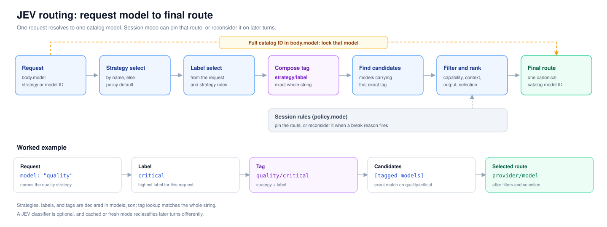

# JEV Gateway

[English](README.md) | **简体中文**

 

JEV Gateway 是一个兼容 OpenAI 对话接口的模型路由网关，按配置的成本、质量和能力规则在多个提供方之间选择模型。客户端指定策略即可，无需写死模型；会话既可以固定模型，也可以逐轮重新选择。

[快速开始](#快速开始) · [模型标识](#模型标识) · [路由策略](#路由策略) · [HTTP API](#http-api) · [文档](#文档) · [许可](#许可) · [开发](#开发)

## 它能做什么

- 提供 `POST /v1/chat/completions`；客户端配置网关地址及目录模型名或策略名后即可接入。
- 可按任务类型、规模与严格程度分类，再从配置的模型池中选择。
- 可选用配置的决策提供方回答带类型的单选题，不可用时采用本地评分或配置的回退规则。
- 支持会话固定模型和逐轮选择；随仓库提供的 `task_aware` 策略使用 `fresh` 模式。
- 为每条路由推导 `reasoning_effort` 档位，并收敛到该路由实际接受的取值。
- 将请求、决策、结果和提供方续写状态写入 SQLite，记录失败不影响正常请求。
- 提供实时会话面板和路由检查接口。



## 快速开始

macOS 和 Linux 可直接安装 CLI，无需克隆仓库。需要可通过 `python3` 调用的
Python 3.10+ 和 `curl`：

```bash
curl -fsSL https://github.com/TexasOct/jev-gateway/releases/latest/download/install.sh | sh -s -- --yes
```

该 URL 获取最新稳定版 Release 的安装脚本。每份脚本内嵌自己的 tag，安装前会用
该 tag 下的 SHA256 文件校验 wheel。`--yes` 允许脚本在缺少 `uv` 时安装它。
如需固定到已发布的版本或回滚，使用带 tag 的安装脚本 URL：

```bash
curl -fsSL https://github.com/TexasOct/jev-gateway/releases/download/v0.1.0/install.sh | sh -s -- --yes
```

也可以显式指定预发布 tag。向其他 Release 的安装脚本传入 `--version 0.1.0` 时，
它会校验目标 tag 的安装脚本，并交给该脚本执行一次。缺少文件或校验失败时会停止安装，
不会回退到 `main`。最初通过 `curl | sh` 执行的脚本没有经过校验和检查。
固定 tag 后下载、审阅和校验的完整步骤见
[`docs/local-install.md`](docs/local-install.md#verify-installer)。

curl 安装脚本不支持 Windows。源码或 Docker 安装方式见
[`docs/local-install.md`](docs/local-install.md)。

源码开发需要 Python 3.10+、[`uv`](https://docs.astral.sh/uv/) 和带 npm 的 Node.js
（Release 工作流使用 Node.js 22）。从仓库安装前，先构建面板：

```bash
git clone https://github.com/TexasOct/jev-gateway.git
cd jev-gateway
uv sync --all-groups
npm --prefix frontend install
scripts/build-frontend.sh
```

源码安装使用本地脚本初始化运行目录；curl 安装已完成这一步。
两种方式都会保留已有配置和记录：

```bash
./scripts/install-local.sh --editable
```

编辑 `$HOME/.jev-gateway/` 下的两个文件：

```bash
${EDITOR:-vi} "$HOME/.jev-gateway/models.json"  # 提供方、模型、策略
${EDITOR:-vi} "$HOME/.jev-gateway/.env"         # models.json 声明引用的密钥
```

把示例地址和模型名替换为你的提供方实际支持的值。模板声明了两个提供方，对应的 `.env` 需要：

```dotenv
DEEPSEEK_API_KEY=replace-with-deepseek-key
OPENAI_API_KEY=replace-with-openai-key
```

curl 安装后用 `jev start` 启动网关；源码安装使用本地启动器：

```bash
~/.local/bin/jev-gateway-local
```

在另一个终端发出第一个请求：

```bash
curl http://127.0.0.1:8000/v1/chat/completions \
  -H 'Content-Type: application/json' \
  -d '{"model": "task_aware", "messages": [{"role": "user", "content": "Summarize this design."}]}'
```

模板默认关闭外部决策，启用 `decision` 前 `task_aware` 使用配置的回退规则。兼容端点的 `decision.providers[].protocol` 设为 `system_one`；仅在端点需要时填写 `model`。
`GET /healthz` 可以确认进程已启动。长期运行、容器与 wheel 安装方式见
[`docs/local-install.md`](docs/local-install.md)。

## 模型标识

目录中的模型用包含提供方的完整 ID 索引，即 `<provider>/<upstream_model>`。`providers` 统一定义连接设置，每个模型引用一个提供方，再补充能力、上限、成本和路由标签：

```json
{
  "providers": [
    {"id": "deepseek", "type": "deepseek", "api_base": "https://api.deepseek.com/v1", "api_key_env": "DEEPSEEK_API_KEY"}
  ],
  "models": [
    {"provider": "deepseek", "upstream_model": "deepseek-flash", "tags": ["task_aware/draft"], "context_window": 1000000}
  ]
}
```

这个模型的 ID 是 `deepseek/deepseek-flash`。手动指定模型时不能只写上游模型名，因为不同提供方可能使用同名模型。完整字段说明见 [`docs/models-config.md`](docs/models-config.md)。

## 路由策略

每个具名策略同时也是一个虚拟模型名。把策略名放进请求体的 `model` 字段即可，默认策略是 `task_aware`。

```json
{"model": "quality", "messages": [{"role": "user", "content": "Review this design."}]}
```

每个策略从顶层 `policy` 块继承设置，并可按需覆盖 `selection`、`mode`、`labels` 与推理规则。内置模式有 `sticky`、`cached`、`escalate`、`adaptive` 和 `fresh`；可显式选择 `policy`、`decision` 和 `decision_matrix` 这三种内置策略类型。旧的 `jev` 和 `jev_matrix` 类型已移除，现有配置需在启动前更新。写入 `openai/gpt-5.6-sol` 这样的完整目录模型 ID，则直接选择该模型。省略 `kind` 时使用 `auto` 分派，详见设计文档。

这是旧配置与 Python 调用方需要处理的破坏性变更：顶层 `jev` 必须改为 `decision`，`sources` / `default_source` 改为 `providers` / `default_provider`，并显式填写协议。`JevSettings`、`JevSource`、`jev_from_dict`、`Catalog.jev`、`JevClient`、`JevClassifier`、`JevStrategy`、`JevMatrixStrategy`，以及 `DecisionSettings.default_source` / `.sources` 访问器均已移除。记录原因的前缀从 `jev:`、`jev_matrix:` 改为 `decision:`、`decision_matrix:`，`X-JEV-Reason` 响应头名称不变。迁移细节见[配置文档](docs/models-config.md)。

只有请求体的 `model` 字段能选择策略：`?strategy=` 会返回 `400`，请求头 `X-JEV-Strategy` 不参与选择。设计与配置细节见 [`docs/routing-design.md`](docs/routing-design.md)。

## HTTP API

| 方法 | 路径 | 用途 |
| --- | --- | --- |
| `GET` | `/healthz` | 存活状态与配置快照。 |
| `GET` | `/dashboard` | 内置的运维面板，用于监控与路由配置。 |
| `GET` | `/v1/models` | 策略名与目录模型 ID。 |
| `GET` | `/v1/routing/policy` | 当前策略快照。 |
| `GET` | `/v1/routing/strategies` | 已注册的策略及其策略配置。 |
| `POST` | `/v1/routing/preview` | 只预览路由结果，不实际转发。 |
| `POST` | `/v1/routing/reload` | 重新读取目录文件。 |
| `GET` | `/v1/routing/decisions/{decision_id}` | 单条保留的决策。 |
| `GET` | `/v1/routing/sessions` | 实时会话列表。 |
| `GET` | `/v1/routing/sessions/{session_id}` | 单个实时会话。 |
| `GET` | `/v1/routing/sessions/{session_id}/requests` | 某个会话保留的请求。 |
| `GET` | `/v1/routing/providers/summary` | 提供方保留的活动统计。 |
| `GET` | `/v1/routing/configuration` | 可编辑的路由配置面。 |
| `POST` | `/v1/routing/configuration/validate` | 校验覆盖内容但不应用。 |
| `PUT` | `/v1/routing/configuration` | 在 `models.json` 旁应用覆盖内容。 |
| `DELETE` | `/v1/routing/configuration` | 将路由恢复到基线文件。 |
| `GET` | `/v1/dashboard/theme` | 面板已保存的主题种子色。 |
| `PUT` | `/v1/dashboard/theme` | 保存面板主题种子色。 |
| `DELETE` | `/v1/dashboard/theme` | 重置面板主题。 |
| `POST` | `/v1/chat/completions` | OpenAI 兼容的对话补全。 |

成功的对话响应会带上 `X-JEV-Route`、`X-JEV-Provider`、`X-JEV-Model`、`X-JEV-Route-Label`、`X-JEV-Task-Type`、`X-JEV-Mode`、`X-JEV-Reason`、`X-JEV-Strategy`、`X-JEV-Decision-Id`，并在适用时附带请求、会话、切换、推理与切换受阻原因的响应头。端点契约、鉴权、错误码与 reload 语义见 [`docs/http-api.md`](docs/http-api.md)。

## 文档

| 文档 | 内容 |
| --- | --- |
| [`docs/local-install.md`](docs/local-install.md) | curl、本地、容器与 wheel 安装。 |
| [`docs/cli.md`](docs/cli.md) | CLI 命令、提供方设置与生命周期管理。 |
| [`docs/models-config.md`](docs/models-config.md) | `models.json` 的全部字段。 |
| [`docs/routing-design.md`](docs/routing-design.md) | 路由契约、策略、会话与证据。 |
| [`docs/http-api.md`](docs/http-api.md) | 端点、响应头、错误与 reload。 |

## 许可

本项目以 [GNU Affero 通用公共许可证第 3 版或更新版本](LICENSE)（`AGPL-3.0-or-later`）授权。你可以在其条款下使用、修改和分发本项目。第 13 条补充了网络条款：如果你把修改版作为网络服务运行，就必须以同一协议向该服务的用户提供对应的源代码。协议允许商业托管，但受协议约束的修改版必须向这些用户提供对应源代码。

## 开发

在仓库根目录安装依赖并构建面板，再运行完整测试或打包：

```bash
uv sync --all-groups
npm --prefix frontend install
scripts/build-frontend.sh
uv run pytest -q
uvx pyright
uv build
```

`GET /dashboard` 的面板是 `frontend/` 下的 Vite + React 应用。生成目录
`jev_gateway/static/` 被 Git 忽略。源码安装、wheel 构建和使用面板的测试需要前端依赖。
pytest 的会话级 `dashboard_bundle` fixture 会通过 `npm --prefix frontend run build`
重建一次面板，但不会安装 npm 依赖。已安装的 Release wheel 自带面板，不需要 Node.js。

改动 `frontend/` 后，重新构建并检查：

```bash
scripts/build-frontend.sh           # 构建到 jev_gateway/static
scripts/build-frontend.sh --check   # 生成产物缺失或过旧时报错
npm --prefix frontend run lint
npm --prefix frontend run test
```

Dockerfile 在 `uv build` 之前用 Node 阶段从 `frontend/` 构建面板。
Release 工作流也会在 Python 测试和 wheel 打包前完成构建，再校验 wheel 内容。
带 tag 的产物校验和发布步骤见 [`docs/releasing.md`](docs/releasing.md)。

打包产物名为 `jev-gateway`，并提供 `jev-gateway`（前台服务）和 `jev`（管理 CLI）两个命令行入口。
